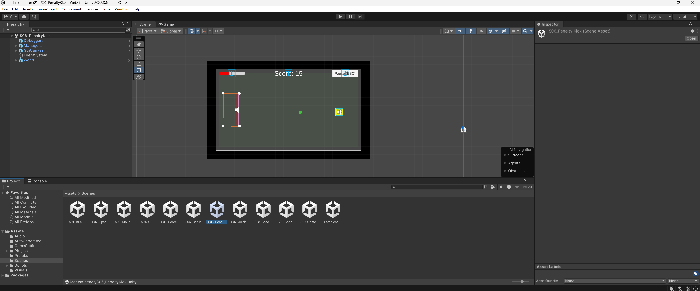

# Assignment 14.2 - Penalty Kick Build

This Unity project is a simple penalty kick mini-game developed for Assignment 14.2 of the course.  
The game is based on the **S06_PenaltyKick** scene and allows the player to kick a soccer ball into a goal by pressing the spacebar at the right time.  

The project includes multiple Git branches, a proper `.gitignore` file for Unity, a screenshot of the project in Unity, and a playable build uploaded to itch.io.

## 🔀 Git Branches

- `main`: Final version of the project.
- `development`: Active development branch.
- `feature/kick-adjustment`: A test branch used to implement and test new features.

## 📸 Screenshot

Screenshot of the S06_PenaltyKick scene in Unity:

## 📂 Repository Includes

- Unity project with `S06_PenaltyKick` scene
- A Unity-specific `.gitignore` file (auto-generated)
- `README.md` describing the project
- A screenshot stored in the `Screenshots/` folder
- Three Git branches (`main`, `development`, `feature/kick-adjustment`)

## 🔗 Submission Links

- 🔧 GitHub Repository: [https://github.com/clarewyc/Assignment-14.2--Make-a-Build](https://github.com/clarewyc/Assignment-14.2--Make-a-Build)
- 🎮 Playable Build on itch.io: [https://clarewycgmailcom.itch.io/penaltykick](https://clarewycgmailcom.itch.io/penaltykick)
